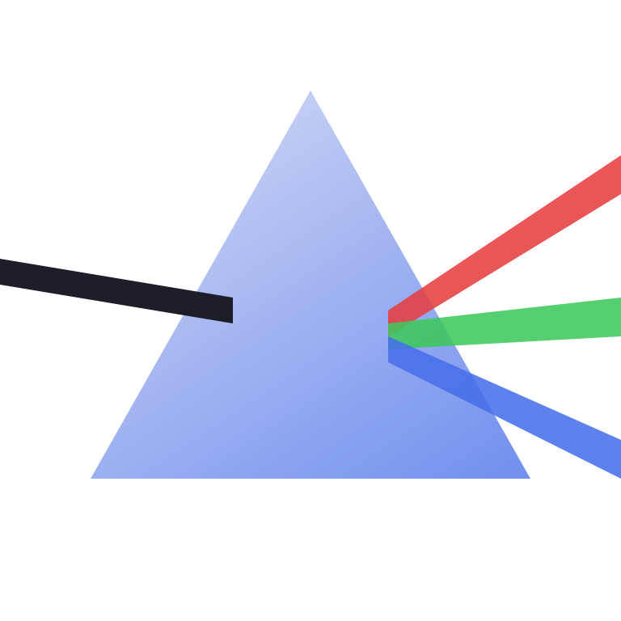

# PRISM

A universal image format: one container, a lossless raster payload with a format-defined reconstruction function for scaling, and a compact binary vector payload for geometric content. A low-level Rust project, spec-driven; the spec is written and agreed before any encoder code exists.

Current state: all four implementation phases complete (container + raster codec, reconstruction, vector payload, encryption wrapper). The vector payload is implemented (pooled colors/styles/paths, zigzag varint deltas, gradients, reference rasterizer with 4x4 supersampling); this 214-byte `.prism` file renders crisp at any size:

Phase 2 delivered the flagship raster feature: The container and raster codec round-trip; on the synthetic corpus PRISM compresses to 34.0% of raw against QOI's 38.2% and PNG's 35.9% ([docs/benchmarks.md](docs/benchmarks.md)). The mandated reconstruction is implemented in integer-only fixed point, so every conforming viewer scales identically ([docs/reconstruction-spec.md](docs/reconstruction-spec.md)); nearest-neighbor vs PRISM at 8x from a 913-byte file:

Layout: [docs/SPEC.md](docs/SPEC.md) is the top-level spec; [docs/container.md](docs/container.md) and [docs/raster-payload.md](docs/raster-payload.md) are the normative byte-level definitions; [docs/research/](docs/research) holds the Phase 0 study notes; [docs/teaching/](docs/teaching) holds the Rust lessons the implementation generates, starting with a plain-English intro and a glossary so no image processing background is assumed; `crates/prism-core` is the dependency-free format library and `crates/prism-cli` the `prism` tool (encode, decode, info, bench, gen-corpus).
